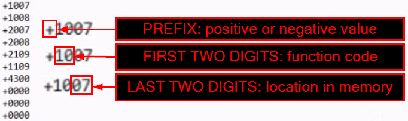

# <u>UVSim</u>

**UVSim** is a simple virtual machine used to help users execute their own machine language basicML code. It contains a CPU, register, and main memory. An accumulator – a register into which information is put before the UVSim uses it in calculations or examines it in various ways.

All the information in the UVSim is handled in terms of words. A **word** is a signed four-digit decimal number, such as +1234, -5678. The UVSim is equipped with a 100-word memory, and these words are referenced by their location numbers 00, 01, ..., 99. The BasicML program must be loaded into the main memory starting at location 00 before executing. Each instruction written in BasicML occupies one word of the UVSim memory (instruction are signed four-digit decimal number). We shall assume that the sign of a BasicML instruction is always plus, but the sign of a data word may be either plus or minus. Each location in the UVSim memory may contain an instruction, a data value used by a program or an unused area of memory. The first two digits of each BasicML instruction are the operation code specifying the operation to be performed.

---

### <u>Running the GUI based application</U>
- Clone the repository.
    > **Note:** You will need the directory path of where you are placing your clone (or files) of the repository, so it may be worth jotting down the location.
- Create your UVSim's BasicML supplementary file, you can do this by following the instructions in the `Creating Your BasicML File` section below.

#### For Windows:
1. Open a Windows Command Prompt.

    > This can be done by searching for `cmd` in the Windows search bar and clicking on the Command Prompt application.

2. Navigate to the directory where you cloned the repository

    > This can be done by using the change directory `cd` command.
     ```cmd
     cd path\to\repository
     ```

3. Navigate to the prog folder

4. Execute the file "gui.exe"

5. The program should now have opened in a separate window


---

### <u>Using the GUI</u>

#### Adding/Modifying Instructions:

1. Locate the large rectangular box on the left side of the screen

    > The box contains 2 rows, 1 labeled "Memory Adresses" and the other labeled "Instruction"

2. Locate the memory address where the instruction is to be added

    > The program will always start reading instructions at address 0 when run

3. In the instruction column, double click on the cell next to the desired memory address

4. Type a 4 digit number representing a value or instruction and hit the "Enter" key when finished

    > If an invalid character is entered or a value that is too large, an error message will be printed in the console (Large box on the right side of the screen) and the value inside the instruction cell will not change.

#### Importing a File:

1. Click the button on the bottom left of the sceen labeled "Import Instructions"

    > A window should pop up showing your file system

2. Navigate to the directory that contains your file of BasicML instructions

3. Select the desired file, and open it

    > The window should now close and instructions from the file should be shown in under the "Instruction" toward the left side of the screen.

4. If errors were found in the file, appropriate error messages will be printed in the console. Resolve the errors in order to load the file into memory

5. Once the file has been loaded in, you can modify any of the instructions by following the steps under "Adding instructions to memory"

#### Running Instructions:

1. Load instructions into the virtual memory system following the steps under "Importing a file" or "Adding/modifying instructions"

2. Using the cursor, click the button labeled "Run" found toward the bottom right of the application

3. The instructions should now run starting at memory location 0 and stopping when a halt instruction is read or the end of memory is reached.

    > If a read instruction is run, a popup window will appear and propt the user for input

4. If input is prompted, type a number (4 digits or fewer) and click the button labeled "submit"

    > If an invalid character is entered an error message will be printed to the console and the popup window will appear again to request user input. (Values greater than 4 digits will be truncated before checking validity)

#### Save Instructions:

1. Using the cursor, click the button located toward the bottom left of the screen labeled "Save Instructions to File"

    > A popup window should appear with access to your local file system

2. Enter the name of the file to save instructions to in the "Save as" text field

3. Choose the directory where the file should be stored

4. Press the save button (using the cursor) when ready to save the file

    > A message should appear in the Console window "Instructions exported successfully"

#### Change Theme:

1. Using the cursor, click the button in the top left of the application labeled "Settings"

    > A popup window should appear with RGB fields for both primary and secondary colors

2. Enter values in the text field associated with R, G, or B for the desired color

3. When all values have been entered, click accept (using the cursor) to update the theme of the application
 
---

### <u>Installation (for terminal based application)</u>

- Clone the repository.

    > **Note:** You will need the directory path of where you are placing your clone (or files) of the repository, so it may be worth jotting down the location.

- Create your UVSim's BasicML supplementary file, you can do this by following the instructions in the `Creating Your BasicML File` section below.

#### For Windows:

> **Note:** The following instructions are tailored for using the [MinGW](https://www.mingw-w64.org/) g++ compiler. If you do not have a compiler for C++ installed please go to the Compiler section below and follow the MinGW setup instructions.

1. Open a Windows Command Prompt.

    > This can be done by searching for `cmd` in the Windows search bar and clicking on the Command Prompt application.

2. Navigate to the directory where you cloned the repository.

    > This can be done by using the change directory `cd` command.
     ```cmd
     cd path\to\repository
     ```

3. Here you will need to compile the UVSim's source code.
    ```cmd
    mingw32-make
    ```

4. Once the compilation is complete, you will have an executable file named `UVSim.exe` in the same directory as the source code. You will now proceed to the next section `Creating Your BasicML File` to create your BasicML file.

#### For MacOS:

**NOT CURRENTLY IMPLEMENTED**

#### For Linux:

**NOT CURRENTLY IMPLEMENTED**

---

### <u>Creating Your BasicML File</u>

As a final step before executing, you will need to create a plain text file with the extension `.txt` that contains lines of BasicML code you want to run in the UVSim.

All values should be in the following format of a signed four-digit decimal number (5 positional characters with the first being a plus or minus symbol followed by 4 digits, each being an integer between 0-9) and should be separated onto their own line:

> ±####

<u>Example:</u>

```plaintext
+1007
+1008
+0000
+0000
```

For any lines that are meant to be instructions and not simply numeric values, you will still follow the same signed four-digit decimal number format but with the following structure: 

> ± [opcode] [memory address]

Position 1: Sign  
Position 2 & 3: Opcode  
Position 4 & 5: Memory Address

<u>Visual Representation:</u>


For a list of available opcodes and their descriptions, please refer to the Operation Codes section below.

<u>Operation Codes:</u>

> **I/O operations:**  
**10:** READ – *Read a word from the keyboard into a specific location in memory.*  
**11:** WRITE – *Write a word from a specific location in memory to screen.*

>  **Load/store operations:**  
**20:** LOAD – *Load a word from a specific location in memory into the accumulator.*  
**21:** STORE – *Store a word from the accumulator into a specific location in memory.*

> **Arithmetic operations:**  
**30:** ADD – *Add a word from a specific location in memory to the word in the accumulator (leave the result in the accumulator).*  
**31:** SUBTRACT – *Subtract a word from a specific location in memory from the word in the accumulator (leave the result in the accumulator).*  
**32:** DIVIDE – *Divide the word in the accumulator by a word from a specific location in memory (leave the result in the accumulator).*  
**33:** MULTIPLY – *Multiply a word from a specific location in memory to the word in the accumulator (leave the result in the accumulator).*

> **Control operations:**  
**40:** BRANCH – *Branch to a specific location in memory.*  
**41:** BRANCHNEG – *Branch to a specific location in memory if the accumulator is negative.*  
**42:** BRANCHZERO – *Branch to a specific location in memory if the accumulator is zero.*  
**43:** HALT – *Stop the program.*

---

### <u>Executing Your Code In The VM</u>

1. If you closed your terminal or command prompt, reopen it and navigate to the directory where you cloned the repository.
2. Run the UVSim executable file.

    > **Note:** If you are not at the directory where you cloned the repository, you will get an error message. Make sure to navigate to the correct directory.
   
    For Windows: `UVSim.exe`  
    For MacOS: `./UVSim`  
    For Linux: `./UVSim`

3. You will be prompted to enter the name of the file containing your BasicML code. This needs to be the file name with the extension `.txt`.

    > **Note:** If you are not in the correct directory, you will get an error message. Make sure to navigate to the correct directory.

4. The UVSim will execute your BasicML code and display the output in the terminal. If you have any I/O operations, you will be prompted to enter values.

    > **Note:** If you have any I/O operations, you will need to enter values in the terminal. If you do not enter a value, the UVSim will not proceed.

5. If you have no errors in your BasicML code, the UVSim will execute your code and perform the operations you have specified.

    > **Note:** If you have any errors in your BasicML code, the UVSim will display an error message and stop the execution.

6. If you need to run the UVSim again or want to try a different or updated BasicML file, you can do so by repeating steps 2-5.

7. If you run into any issues where your code seems to be stuck in an infinite loop, you can stop the UVSim by pressing `Ctrl + C` or `cmd + C` in the terminal.

    > **Note:** This will stop the UVSim and you will need to restart the UVSim to run your code again.

---

### <u>Compiler</u>

#### For Windows:

1. Install MinGW-w64:
   - Download and install [MinGW-w64-builds](https://www.mingw-w64.org/downloads).
   - During the installation process, make sure to include `mingw32-make`.

2. Add MinGW-w64 to the System PATH:
   - Open the System Properties (Right-click on This PC or Computer on the desktop or in File Explorer, and then select Properties).
   - Click on Advanced system settings.
   - Click on Environment Variables.
   - In the System variables section, find the Path variable, and click Edit.
   - Add the path to your MinGW-w64 bin directory. For example:
      ```cmd
      C:\mingw-w64\x86_64-8.1.0-win32-seh-rt_v6-rev0\mingw64\bin
      ```
   - Click OK to close all dialog boxes.


